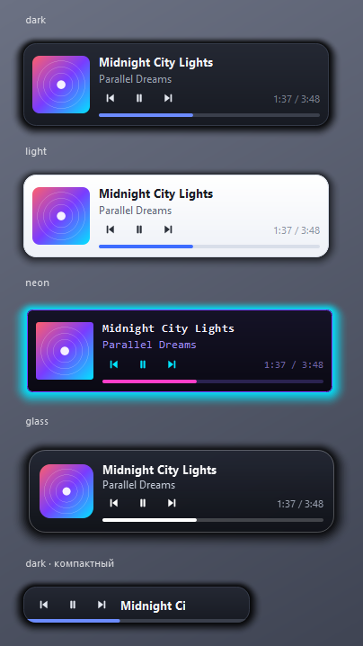

# Tunetop

A small always-on-top music control widget for Windows.

*[Русская версия](README.ru.md)*



It talks to the Windows System Media Transport Controls (SMTC), so it controls **any**
app that registers with the system player: Spotify, browsers (YouTube, SoundCloud),
foobar2000, AIMP, MusicBee, VLC, Media Player, Telegram and so on. No per-player
plugins required.

## Features

- **Always-on-top widget** — frameless, draggable, snaps to screen edges
- **Transport buttons** — previous / play-pause / next, album art, title and artist
- **Track progress** with click-to-seek (when the source publishes a timeline)
- **Skins** — a folder with a `skin.json`: colours, sizes, fonts, corner radius,
  background image, custom icons. Dark, Light, Neon and Glass are bundled
- **13 interface languages**, following Windows by default
- **Global hotkeys** — show/hide, play-pause, next, previous, volume
- **Tray icon** with the current track in its tooltip and a full command menu
- **Source picker** — follow the current Windows player, or pin one specific app
- **Compact mode** — a slim bar with just the buttons (double-click the widget)
- **Start with Windows**, start minimized to tray, opacity, position lock
- Single instance: launching it again just shows the running widget

## Install and run

Requires Python 3.10+ (developed and tested on 3.12).

```bat
run.bat
```

On the first run `run.bat` creates a virtual environment and installs the
dependencies, after that it just starts the widget with no console window.

If something goes wrong, `run-debug.bat` runs the same thing with a visible console.

Manual setup:

```bat
python -m venv .venv && .venv\Scripts\pip install -r requirements.txt && .venv\Scripts\pythonw main.py
```

## Controls

### Mouse

| Action | Result |
|---|---|
| Drag an empty part | move the widget (snaps to screen edges) |
| Double click | toggle compact mode |
| Middle button | play / pause |
| Wheel | system volume |
| Right button | menu (same as the tray menu) |
| Click the progress bar | seek |
| Hover | reveals ⚙ (settings), — (to tray), ✕ (quit) |

### Default hotkeys

| Combination | Action |
|---|---|
| `Ctrl+Alt+M` | show / hide to tray |
| `Ctrl+Alt+P` | play / pause |
| `Ctrl+Alt+→` | next track |
| `Ctrl+Alt+←` | previous track |
| `Ctrl+Alt+↑` / `Ctrl+Alt+↓` | volume up / down |

All of them are configurable: click a field in the settings and press the combination.
`Esc` or `Backspace` clears it. `F1`–`F24` and media keys work without a modifier.
If a combination is already taken by another program, the app says so with a tray
notification instead of failing silently.

## Skins

A skin is a folder containing `skin.json`. Bundled skins live in `skins/`, user skins in
`%APPDATA%\Tunetop\skins` (there is an "Open skins folder" button in the settings).

Only declare what you change — everything else comes from the defaults, or from the skin
named in `extends`.

```json
{
  "name": "My skin",
  "author": "me",
  "extends": "dark",

  "size": [340, 92],
  "compact_size": [252, 40],
  "radius": 14,
  "padding": 10,
  "spacing": 10,
  "art_size": 64,
  "art_radius": 8,
  "button_size": 26,
  "button_gap": 6,
  "progress_height": 4,
  "progress_radius": 2,
  "shadow": 16,

  "background_image": "bg.png",
  "background_image_mode": "stretch",

  "colors": {
    "bg": "#242833",
    "bg2": "#171a22",
    "border": "#333947",
    "shadow": "#70000000",
    "title": "#f3f5f9",
    "artist": "#98a0b0",
    "time": "#787f8d",
    "icon": "#e4e8f0",
    "icon_hover": "#ffffff",
    "icon_disabled": "#4b515e",
    "icon_bg_hover": "#1affffff",
    "accent": "#6c8cff",
    "progress_bg": "#3a3f4b",
    "progress_fg": "#6c8cff",
    "art_placeholder": "#2a2e38",
    "chrome": "#7a8290",
    "chrome_hover": "#ffffff",
    "close_hover": "#ff5f57"
  },

  "fonts": {
    "title": {"family": "Segoe UI", "size": 10, "bold": true},
    "artist": {"family": "Segoe UI", "size": 9, "bold": false},
    "time": {"family": "Segoe UI", "size": 8, "bold": false}
  },

  "icons": {
    "play": "play.png", "pause": "pause.png",
    "next": "next.png", "prev": "prev.png"
  }
}
```

- **Colours** are `#RRGGBB` or `#AARRGGBB` (leading pair is alpha). The card is filled with
  a gradient from `bg` to `bg2`; translucent colours give the glass effect (see the Glass skin).
- **`shadow`** is the shadow radius around the card in pixels, `0` turns it off.
- **`background_image`** is drawn over the gradient; modes are `stretch` / `tile` / `center`.
- **`icons`** are optional — without them buttons are drawn as vectors tinted with `icon`.
- **Fonts** also accept `"italic": true` and `"letter_spacing": 0.4`.
- The layout adapts to any `size`, so the widget can be made bigger or smaller.

Press "Refresh list" in the settings after editing a file; the skin applies immediately.

## Translations

Bundled: English, Русский, Українська, Deutsch, Français, Español, Italiano, Polski,
Português (Brasil), Türkçe, 简体中文, 日本語, 한국어.

A locale is one JSON file: `_meta` plus flat `key: text` pairs. Drop your own into
`%APPDATA%\Tunetop\locales` to add or override a language without rebuilding
anything — files there shadow the bundled ones with the same code.
See [CONTRIBUTING.md](CONTRIBUTING.md) if you would like to send a translation upstream.

## Settings

Stored in `%APPDATA%\Tunetop\settings.json` and applied the moment you change them.
The file is safe to edit by hand — unknown and corrupted values are ignored and replaced
with defaults.

## Project layout

```
main.py                 entry point
app/config.py           settings (dataclass + JSON)
app/i18n.py             translation loading
app/media.py            Windows SMTC bridge (asyncio on a worker thread)
app/hotkeys.py          global hotkeys via RegisterHotKey
app/skins.py            skin loading and merging
app/icons.py            vector icons
app/player_widget.py    the widget itself (fully QPainter-drawn)
app/settings_dialog.py  settings window
app/application.py      tray, menus, wiring
app/system.py           autostart and volume keys
locales/                bundled translations
skins/                  bundled skins
tests/test_basics.py    headless checks (no live media session needed)
```

Run the tests with:

```bat
.venv\Scripts\python tests\test_basics.py
```

## Known limitations

- Windows 10/11 only — SMTC does not exist on earlier versions.
- Progress and seeking only work with sources that publish a timeline. Spotify and
  browsers do; foobar2000 does not, and the bar is hidden rather than shown empty.
- The volume controls change the system volume (like the media keys on a keyboard),
  not the volume of one specific app.

## License

[PolyForm Noncommercial 1.0.0](LICENSE) — free for personal and other noncommercial use.
Note that this is a *source-available* licence, not an OSI-approved open-source one:
commercial use needs a separate licence from the copyright holder.
